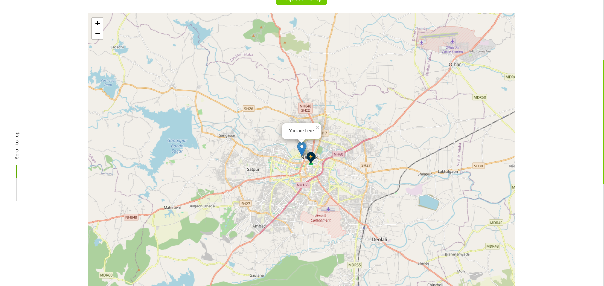

# EV Charging Station Finder & Pickup Assistance

A web-based platform designed to help electric vehicle (EV) owners **locate nearby charging stations** and **request emergency pickup assistance** if their vehicle breaks down. The project integrates **real-time station availability, interactive maps, and a secure booking system** to enhance the EV charging experience.

## Key Features

- **Find Charging Stations**: Users can locate and book nearby EV charging stations.
- **Live Navigation**: Integrated **Google Maps API** for accurate directions.
- **Real-time Availability**: Check slot status and avoid occupied stations.
- **Secure Booking System**: Prevents double bookings and ensures hassle-free reservations.
- **Pickup Assistance**: Users can request roadside pickup if their vehicle is stranded.

## Tech Highlights

- **Frontend**:
  - **HTML**, **JavaScript**, and **Bootstrap 5** for a clean, responsive UI.
  - **Leaflet.js** for an interactive map-based station locator.

- **Backend**:
  - **Node.js** with **Express.js** for handling API requests and bookings.

- **Database**:
  - **MongoDB** for storing user requests, bookings, and station details.

- **Authentication & Security**:
  - **JWT authentication** ensures user data security.
  - **Session management** for tracking bookings and requests.

## Project Setup
### Prerequisites
Ensure you have the following installed:
- **Node.js**: [Download and install Node.js](https://nodejs.org/)
- **MongoDB**: [Set up MongoDB](https://www.mongodb.com/try/download/community) (or use MongoDB Atlas for cloud hosting)

### Installation

1. Clone the folder:
 ```
 Download This Folder
 ```
2. Navigate to the project folder:
```
cd Electric-Vehicle-Recharge-Bunk
```
3. Install dependencies:
```
npm install
```
5. Start the server:
```
node .
```
The platform should now be accessible at `http://localhost:3000` in your browser.

## Contributing
Feel free to fork the repository and submit pull requests for improvements or bug fixes!

## Screenshot



## Author

- [Vedant Deshpande](https://github.com/vmDeshpande)