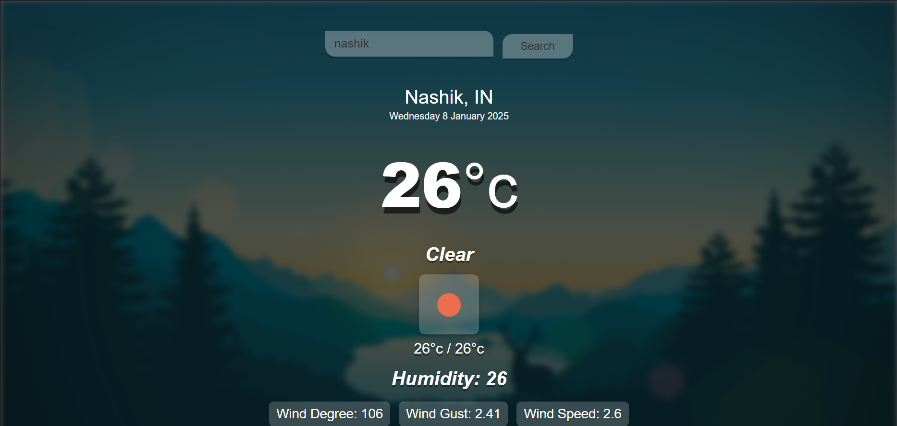

# Weather App

This is a simple weather application built using HTML, CSS, and JavaScript. It fetches weather data from the OpenWeatherMap API and displays the current weather conditions, including temperature, humidity, wind speed, and more, for a city entered by the user.

## Features

- **Search for cities**: Enter a city name and click the "Search" button or press the "Enter" key to get weather information for that city.
- **Current weather details**: Displays the current temperature, weather condition, humidity, wind speed, and more.
- **Responsive design**: The app is designed to be mobile-friendly and adjusts to different screen sizes.

## Technologies Used

- **HTML**: For structuring the webpage.
- **CSS**: For styling the application, including background images, buttons, and text.
- **JavaScript**: For fetching weather data from the OpenWeatherMap API and dynamically updating the webpage.
- **OpenWeatherMap API**: Provides real-time weather data.

## Setup

1. download this folder.
2. Open the `index.html` file in your browser.

## How It Works

1. **API Key**: The app uses an API key to fetch weather data from OpenWeatherMap. The key is stored in the `script.js` file.
   
2. **Search Functionality**:
   - The user enters a city name into the search box and clicks the "Search" button or presses the "Enter" key.
   - The app then fetches the weather data from the API and updates the UI with the city's current weather information.

3. **Weather Display**:
   - The city name, country, date, temperature, humidity, wind speed, wind direction, gusts, and min/max temperatures are displayed.
   - A weather icon representing the current weather condition is dynamically added.

## Usage

1. Open the `index.html` file in your web browser.
2. Type the name of a city in the search box.
3. Click the "Search" button or press the "Enter" key to get the weather data for that city.

## Screenshot

